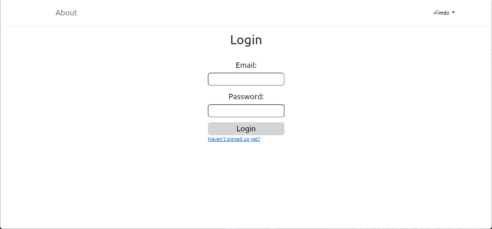

# To-do-list app created with Django 

To run the app do the following:
1. Clone the project
2. Get requirements
3. Delete db.sqlite3 and 0001_initial.py (migrations)

Then run next commands:
1. python manage.py make migrations
2. python manage.py migrate
3. python manage.py createsuperuser
4. python manage.py runserver

## Table of contents

- [Overview](#overview)
  - [The challenge](#the-challenge)
  - [Screenshot](#screenshot)
  - [Links](#links)
- [My process](#my-process)
  - [Built with](#built-with)
  - [What I learned](#what-i-learned)
  - [Continued development](#continued-development)
  - [Useful resources](#useful-resources)
- [Author](#author)
- [Acknowledgments](#acknowledgments)

## Overview

### The challenge

Users should be able to:

- View the optimal layout depending on their device's screen size
- See hover states for interactive elements

- See a list of all tasks
- Add a task
- Update a task
- Delete a task
- Register
- Login
- Update Profile Info
- Update Profile Picture
- Update Password
- Delete Profile

### Screenshot

<p float="left">
  
  
  
  
  
  
  
  
  
</p>

### Links

- Repository URL: [Add solution URL here](hhttps://github.com/coder-96/to-do-list-django)

## My process

### Built with

Frontend:
- HTML5
- CSS
- Flexbox, CSS Grid
- Bootstrap 5

Backend:
- Django Framework 4.2.6
- SQLite

### What I learned

Improved my CRUD, Python, Django, and Django CBV skills.

```python
class TodoListView(LoginRequiredMixin, ListView):
    model = Todo
    # queryset = Todo.objects.all()

    def get_context_data(self, **kwargs):
        context = super().get_context_data(**kwargs)
        context["todo_list"] = context["todo_list"].filter(user=self.request.user)
        context["count"] = Todo.objects.filter(done=False, user=self.request.user).count()

        search_input = self.request.GET.get("search-area") or ""
        if search_input:
            context["todo_list"] = context["todo_list"].filter(name__startswith=search_input)
        context["search_input"] = search_input
        return context
```

### Continued development

I'm focused on perfecting my Django, Flask skills by building more projects.

### Useful resources

- [MDN Web Docs](https://developer.mozilla.org/en-US/) - helped me find answers when I got stuck.

## Author

- Website - [Jalga](https://github.com/coder-96)

## Acknowledgments

I thank my family for supporting me on my way to becoming a Developer. 